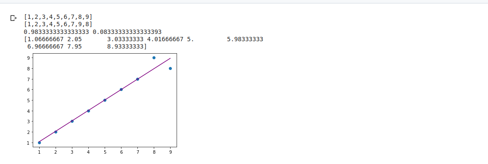

# Implementation of Univariate Linear Regression
## Aim:
To implement univariate Linear Regression to fit a straight line using least squares.
## Equipment’s required:
1.	Hardware – PCs
2.	Anaconda – Python 3.7 Installation / Moodle-Code Runner
## Algorithm:
1.	Get the independent variable X and dependent variable Y.
2.	Calculate the mean of the X -values and the mean of the Y -values.
3.	Find the slope m of the line of best fit using the formula.
 
4.	Compute the y -intercept of the line by using the formula:
  
5.	Use the slope m and the y -intercept to form the equation of the line.
6.	Obtain the straight line equation Y=mX+b and plot the scatterplot.
## Program
```
Developed by : nivetha.a
RegisterNumber:22003573

import pandas as pd

from sklearn import linear_model

df=pd.read_csv("cars.csv")

x=df[['Weight','Volume']]

y=df['CO2']

regr=linear_model.LinearRegression()

regr.fit(x,y)

print('Coefficients:',regr.coef_)

print('Intercept:',regr.intercept_)

predictedCO2=regr.predict([[1995,522]])

print("Predicted CO2 emissiom based on weight and volume:",predictedCO2)

```
## Output



## Result
Thus the univariate Linear Regression was implemented to fit a straight line using least squares.
